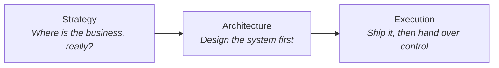
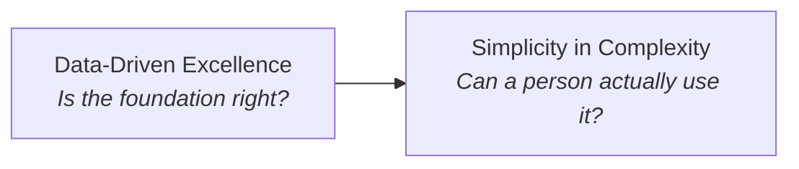
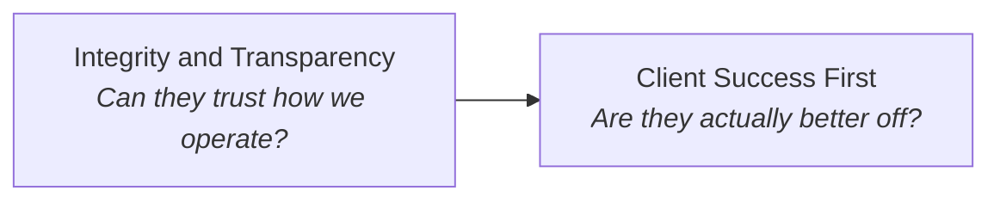
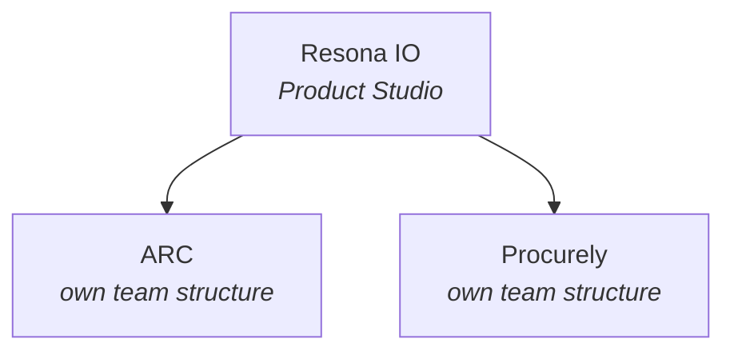
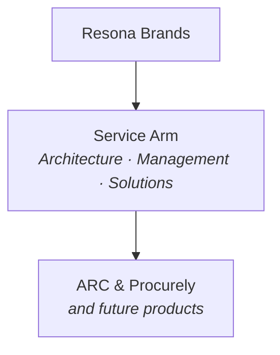
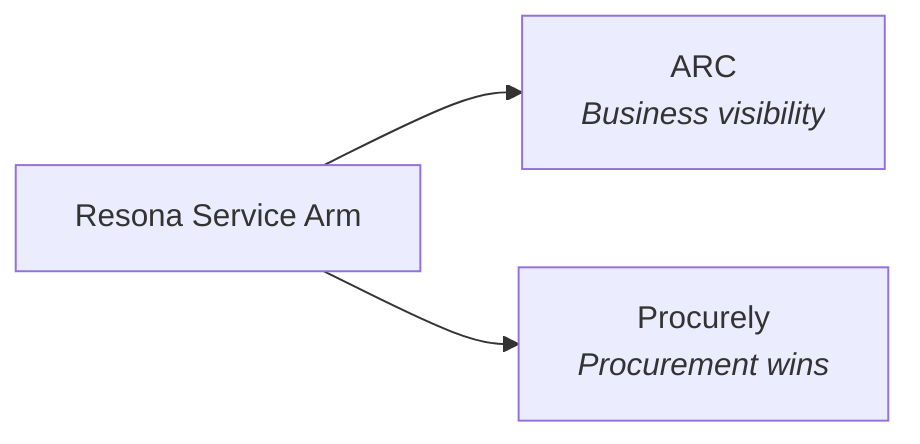

# Resona Foundations Content Build — Status: Built and Seeded

This course is live in the Civix Supabase project (migrations `0010_resona_foundations_schema.sql`, `0011_resona_foundations_content.sql`). This doc is kept as the historical content source and a record of the decisions actually made — not an open handoff anymore.

## Corrections to the original handoff

The original version of this doc assumed migrations `0001`–`0006` were the full set and asked whoever picked it up to confirm that. By the time this course was built, the repo was actually at `0009` (multi-tenancy/`organizations`, and a role-vocabulary swap from a generic training-platform framing to Resona's real org roles — `zone_manager`/`sales_rep`/`sourcing_operator`/`developer`/`founder`, plus `admin`/`trainee`). Courses/modules/lessons/lesson_pages/content_blocks have no `org_id` — they're shared content across orgs by design, unaffected by that tenancy work. `enrollments` does have `org_id` (`not null`), which the auto-enrollment logic below accounts for.

## Architecture decisions (resolved)

### Decision 1: Module-check lessons

Modeled as ordinary lessons — same schema, same nav, same content_blocks — with a new `lessons.is_check boolean` flag (migration `0010`) so the app can identify them without inferring from position. Each 2-question module check is two sequential single-question `activity` content_blocks on one page, not one block holding two questions (see the gating note below for why).

### Decision 2: Course-level hard gate

RLS-enforced, not application-layer: `public.has_completed_course(course_id)` (new function, migration `0010`) checks whether every lesson in a course has a `completed` `user_progress` row for the current user. `public.can_access_course()` now requires, for every course other than Foundations, that the user has both an enrollment **and** a completed Foundations course. Verified live: an enrolled-but-incomplete user is blocked from a second course; the same user unlocks it immediately once every Foundations lesson shows `completed`; `admin`/`zone_manager` bypass is unaffected.

### Decision 3: `image` block rendering

Hand-authored static SVG at seed time (inlined as base64 data URIs in `content.src`, via Postgres's built-in `encode()`/`convert_to()` — no mermaid-rendering dependency needed for seven simple flowcharts). `ContentBlockRenderer`'s `image` case now renders a real `` instead of the placeholder div.

### Decision 4 (not in the original doc): the gating engine itself didn't exist

Verifying this build surfaced that "wrong answers gate, cannot proceed" — this doc's central requirement — had no implementation anywhere in the app. `KnowledgeCheck` scored answers but had zero effect on `LessonReader`'s `Next`/`Mark page complete` controls, which were completely unconditional. Built from scratch:
- The gating flag lives inside the `activity` block's own `content` JSON (`gates_progress: boolean`) — no migration needed, and it keeps the 100%-required standard scoped to this course's activities rather than becoming a global rule (per the standing rule below).
- Persistence is the `activity_attempts` table (in the schema since migration `0002`, unused until now) via a new `lib/persistence/activity-attempts.ts` adapter and `app/api/persistence/activity-attempts/route.ts`, following the exact convention already used for notes/bookmarks/progress.
- `activity_attempts`' RLS only allows an authenticated `INSERT` with `status in ('started','submitted')` and `score`/`max_score` forced `null` — deliberately, so a client can never self-report a pass. Grading happens server-side (reusing the existing `scoreQuestion()` from `lib/learning-engine/scoring.ts`, not a duplicated SQL implementation), and the authoritative `passed`/`failed` + score row is written with the service-role client — the first real use of `lib/supabase/service-role.ts` in this app.
- `LessonReader` hydrates which gating blocks the current user has already passed and disables `Next`/sidebar-forward-navigation/`Mark page complete` until every gating block on the active page is passed.

## Grading & Gating Rules (apply to every activity block in this course)

- Every mastery-check and module-check activity requires **100% correct** to mark the lesson/check complete.
- Wrong answers **gate** — the learner cannot proceed until they select the correct answer. Do not allow "skip and continue."
- Mid-lesson retrieval-practice activities (one per lesson, not the final mastery check) should also gate on the correct answer, consistent with the same standard.
- This 100%/locked-until-correct standard applies **only within this course's activities** — do not assume it as a global rule for future courses unless told.

## Enrollment Rule

- Every user (current and future) gets a `course_enrollment_status = 'assigned'` row for Resona Foundations. `handle_new_user()` (migration `0010`) does this for new signups; a one-time backfill (migration `0011`) covered the profiles that existed before the course did.
- No other course is accessible to a user until Foundations shows full completion — the Decision 2 gate above.

## Known follow-up, deliberately not built yet

The course-end cumulative review lesson was **not seeded**. Its exact question set was explicitly deferred in the original doc to a follow-up content pass, and `has_completed_course()` only checks "every lesson in the course is completed" — so adding that lesson later needs no gating-logic changes, just an additional lesson row appended to Module 4.

Deep body-content fidelity note: bullet lists in the source content below were flattened into separate `rich_text` body-array entries (one paragraph per bullet) rather than real markup, since `ContentBlockRenderer`'s `rich_text` case has no list-rendering support today — a content-fidelity compromise worth knowing about, not a UI feature this build added.

## Content Payload (source reference — see live DB for the actual seeded rows)

Course-level:
- `slug`: `resona-foundations`
- `title`: Resona Foundations
- `description`: "An introduction to Resona IO — A Product Studio building strategic software for operational clarity, and the mission, culture, and structure behind it."
- `certification_id`: null
- `position`: 1

### MODULE 1: Mission, Culture & Vision

#### Lesson 1.1 — The Resona Story

**Page 1 — The Problem**

`rich_text`:
> Resona started as an analytics firm in 2024, providing enterprise-level clarity to small businesses across the country.
>
> Most small and mid-size businesses aren't short on data. They're short on a system that turns that data into a decision.
>
> The scale of the gap:
> - 34 million+ SMBs in the US
> - Roughly 70% operate without an in-house data team
> - $1.2 trillion lost industry-wide, every year, to decisions made on incomplete, inaccurate, or disconnected data
>
> They're not ignoring their numbers. They don't have the infrastructure enterprise companies have had for decades — the analysts, the tooling, the operating discipline to turn raw numbers into a next move.

`callout` (info):
> **Key distinction:** Not a data problem. A clarity problem — and clarity has to be built deliberately.

**Page 2 — The Evolution**

`rich_text`:
> As client needs evolved, providing clarity and insight wasn't enough. Businesses needed help *fixing* what the insight uncovered. Resona evolved from an analytics firm into a strategic software company, servicing businesses through strategy, architecture, and digital solutions.
>
> The order:
> - **Strategy first** — where the business actually is, not where it assumes it is
> - **Architecture second** — the system before the build
> - **Execution third** — ship it, install the capacity to run it
>
> That progression produced Resona's own flagship methodology, ARC (Adapt → React → Control) — proof of the process on the company that built it, before it was offered to anyone else.

`image` (mermaid, render to static SVG):

`activity` (retrieval, multiple choice, gated):
> Q: Put Resona's process in the correct order.
> A) Architecture → Strategy → Execution
> B) Strategy → Architecture → Execution — CORRECT
> C) Execution → Strategy → Architecture
> D) Strategy → Execution → Architecture

**Page 3 — Recap**

`callout` (success):
> **Takeaway:** Resona builds strategic software that gives businesses the operational clarity to compete, grow, and make decisions with confidence.

`activity` (mastery check, multiple choice, gated, 100% required):
> Q1: What was Resona originally founded to do in 2024?
> A) Build mobile apps for small businesses
> B) Provide enterprise-level data clarity to small businesses — CORRECT
> C) Manage government contracts for SMBs
> D) Offer legal consulting for startups
>
> Q2: Why did Resona evolve beyond just providing insight?
> A) Clients wanted a cheaper product
> B) Insight alone wasn't enough — clients also needed help executing solutions — CORRECT
> C) The analytics market became too competitive
> D) Resona wanted to focus only on software, not strategy

---

#### Lesson 1.2 — What We Value (Part 1: How We Decide)

**Page 1 — Data-Driven Excellence**

`rich_text`:
> This isn't about being a data company. It's about building the system that turns a number into a decision. Data on its own is a fact — it becomes valuable the moment it's connected to a decision, inside the right operational context. A recommendation without that system underneath it is a guess with a citation.
>
> The standard:
> - Not: "Did we look at the numbers?"
> - But: "Did we build the framework that makes the numbers mean something?"
>
> Strategy comes first — reading the operational reality honestly. Data confirms the strategy is right. It doesn't replace having one.

`callout` (info):
> **Example:** A dashboard full of accurate numbers isn't Data-Driven Excellence. A framework that tells a business owner what to do next, and why — that is.

**Page 2 — Simplicity in Complexity**

`rich_text`:
> We take complex operational systems and make them clear, actionable, and accessible — to everyone the system serves, not just the people who built it.
>
> - A system that's technically sound but too complicated to act on isn't done yet
> - The job is finished when it's usable, not when it's correct
> - Correct-but-unusable is a failure state, not a partial success
>
> Together, these two values describe one posture from two angles: build the right system, then make sure a person — not just a spreadsheet — can run it.

`image` (mermaid, render to static SVG):

`activity` (retrieval, multiple choice, gated):
> Q: What best describes "Data-Driven Excellence" at Resona?
> A) Prioritizing data collection above all else
> B) Building the system that turns data into a decision, not just gathering numbers — CORRECT
> C) Avoiding decisions until enough data exists
> D) Replacing human judgment with automated analysis

**Page 3 — Recap**

`callout` (success):
> **Takeaway:** The goal was never more data. It's a system good enough that data becomes a decision — and simple enough that a person can act on it.

`activity` (mastery check, multiple choice, gated, 100% required):
> Q1 (client scenario — assisted living facility expanding to a new state): Before making that call, what should happen first?
> A) Move forward — the client's confidence in the opportunity is enough
> B) Gather the data and complete due diligence before deciding — CORRECT
> C) Wait until a competitor expands first, then follow
> D) Base the decision on the facility's current-state performance alone
>
> Q2: Why does due diligence matter more in a case like a healthcare expansion than in a lower-stakes decision?
> A) It doesn't — due diligence matters equally everywhere
> B) Higher-stakes decisions carry more downside if the data and context are wrong — CORRECT
> C) Regulations require it, but it wouldn't otherwise be recommended
> D) It's only necessary when a client asks for it directly

---

#### Lesson 1.3 — What We Value (Part 2: How We Treat People)

**Page 1 — Client Success First**

`rich_text`:
> Our success is measured by how well our clients perform. Not by how polished the deliverable looks, not by how sophisticated the system is under the hood — by whether the client is better off.
>
> - A recommendation is judged by its outcome, not its cleverness
> - "Technically delivered" and "actually successful" are not the same thing
> - An impressive system that doesn't move the client's real numbers hasn't succeeded

`callout` (info):
> **Example:** A beautifully architected system a client never fully adopts is not a win. A simple system a client actually runs and grows with is.

**Page 2 — Integrity and Transparency**

`rich_text`:
> Honest, ethical, and transparent in everything we build and every relationship we carry. Given what Resona has access to, this is an operating rule.
>
> - Full transparency about what's accessed, why, where it goes, and when it's removed
> - Explicit consent before any system or data source is touched
> - A client's data is theirs; Resona processes it on their behalf, and it leaves with them at the end of an engagement
> - Every action leaves an audit trail
>
> Client Success First and Integrity and Transparency reinforce each other: a client can only trust that Resona is working in their interest if the relationship is transparent enough to verify it.

`image` (mermaid, render to static SVG):

`activity` (retrieval, multiple choice, gated):
> Q: What does "Client Success First" actually measure?
> A) How polished the final deliverable looks
> B) Whether the client's real outcomes improved — CORRECT
> C) How advanced the technical system is
> D) How quickly the engagement was completed

**Page 3 — Recap**

`callout` (success):
> **Takeaway:** Trust the outcome by trusting the process behind it.

`activity` (mastery check, multiple choice, gated, 100% required):
> Q1 (continuing the assisted living facility scenario — due diligence shows the client's originally preferred state isn't the strongest option): What's the right move?
> A) Proceed with the client's original choice to avoid conflict
> B) Present the honest findings, even if it's not what the client hoped to hear — CORRECT
> C) Soften the findings so the client feels supported either way
> D) Let the client decide without sharing the due diligence results
>
> Q2: Why does Resona maintain an audit trail for every data migration session?
> A) It's a legal requirement with no other purpose
> B) It keeps the relationship transparent and verifiable — CORRECT
> C) It helps Resona bill clients more accurately
> D) It's only used internally and never shared with clients

---

#### Lesson 1.4 — Where We're Headed

**Page 1 — Innovation and Growth**

`rich_text`:
> At Resona, we embrace change and look for smarter, faster, more effective solutions — not just for clients, but in how Resona operates.
>
> This value exists because the gap covered in Lesson 1.1 doesn't close by itself, and it doesn't stay closed once it's closed:
> - The methodology gets refined as more businesses run it
> - The tooling improves as real engagements surface what works
> - The standard for "good enough" keeps moving, on purpose
>
> Innovation and Growth is what keeps Resona from becoming the next version of the enterprise tools it was built to replace.

`callout` (info):
> **Key distinction:** Innovation and Growth isn't chasing new technology. It's refusing to let the system calcify.

`callout` (info, second callout on this page):
> **What this looks like in a person:** The desire to create something new and genuinely impactful — backed by real action, not just ideas talked about. That combination is what Resona looks for and develops in its people.

**Page 2 — How Resona Empowers Businesses**

`rich_text`:
> Resona's impact shows up in outcomes:
> - Roughly 68% of businesses that implement a structured data strategy report measurable revenue improvement within the first year
> - A structured operating cycle produces decisions roughly three times faster, with higher confidence
> - Improvements built on a real Control layer stick — without one, businesses tend to revert to old patterns within 90 days
>
> Resona doesn't stop at handing over a system. Every engagement installs the methodology, tooling, and operating capacity directly into the business — so the client keeps running and improving it after Resona steps back.
>
> Same pattern, different industries: a consumer platform needing architecture and brand before it could function, a medtech hardware company with a strong product and no system around it, a twelve-year retail business with no infrastructure for the shift online. Strategy first, architecture second, execution third — every time.

`image` (mermaid, render to static SVG):

`activity` (retrieval, multiple choice, gated):
> Q: Why does Resona keep refining its methodology instead of treating it as finished?
> A) Clients expect frequent updates regardless of need
> B) What worked as "the system" a year ago isn't automatically the best system today — CORRECT
> C) Competitors require Resona to constantly rebrand
> D) The original methodology was incomplete at launch

**Page 3 — Recap**

`callout` (success):
> **Takeaway:** Resona's impact is measured in businesses that gained clarity and capability once reserved for companies with full analytics teams — through a system that keeps improving instead of standing still.

`activity` (mastery check, multiple choice, gated, 100% required):
> Q1: Why does Resona install the operating capacity into a business instead of just delivering a report?
> A) It's required by the service agreement
> B) So the client can keep running and improving the system after Resona steps back — CORRECT
> C) It reduces Resona's ongoing workload
> D) Reports aren't something clients want
>
> Q2: What happens to improvements that aren't built on a real Control layer?
> A) They typically last indefinitely
> B) They tend to revert to old patterns within about 90 days — CORRECT
> C) They only fail if the client stops paying
> D) They become permanent immediately

---

#### MODULE 1 CHECK (gated, 100% required, unlocks Module 2)

> Q1: What are the three things Resona builds, in order, when working with a client?
> A: Strategy → Architecture → Execution — CORRECT
>
> Q2: Which value is being applied when Resona presents honest findings to a client, even if it's not what they hoped to hear?
> A: Client Success First / Integrity and Transparency — CORRECT (accept either)

---

### MODULE 2: Resona IO

#### Lesson 2.1 — Company Structure

**Page 1 — Company Structure**

`rich_text`:
> Resona operates with a small, founder-led core team.
> - Structure is fluid — roles and responsibilities shift as the company grows
> - A small team means most people carry more than one function
> - There is no large formal hierarchy at this stage

`callout` (info):
> **Key distinction:** Fluid structure still means structure — decisions and ownership are clear even without a formal org chart.

**Page 2 — Resona, ARC, and Procurely**

`rich_text`:
> Resona operates as **a Product Studio** — it builds its own products and, through that same expertise, builds for others. ARC and Procurely are the clearest proof of that: both are Resona's own products, built using the same strategy-first discipline the studio applies to every engagement.
> - Each product has its own team structure, covered in that product's own course
> - Resona builds the architecture and operating discipline; ARC and Procurely are two expressions of that discipline, shipped as standalone products

`image` (mermaid, render to static SVG — note: bare noun-phrase "Product Studio" in diagram label, per house style):

`activity` (retrieval, multiple choice, gated):
> Q: What does "Resona IO — A Product Studio" mean in practice?
> A) Resona only builds products for outside clients, never its own
> B) Resona builds its own products and applies the same expertise to build for others — CORRECT
> C) "Studio" means Resona only does branding work, not software
> D) Resona has stopped building its own products in favor of client work

**Page 3 — Recap**

`callout` (success):
> **Takeaway:** Resona IO is a Product Studio. ARC and Procurely are its own products, and proof of the same discipline the studio applies to every engagement.

`activity` (mastery check, multiple choice, gated, 100% required):
> Q1: How would you best describe Resona's identity?
> A) A pure software company with no service work
> B) A Product Studio that builds its own products and builds for others — CORRECT
> C) A branding agency that occasionally builds software
> D) A holding company with unrelated business lines
>
> Q2: Where would you go to learn about ARC's or Procurely's specific team structure?
> A) This lesson covers it in full
> B) Each product's own course — CORRECT
> C) Team structure isn't documented anywhere
> D) It's identical across both products

---

#### Lesson 2.2 — The Service Arm

**Page 1 — What the Service Arm Covers**

`rich_text`:
> Resona IO identifies as **a Product Studio** — externally, this is the name people will recognize. Internally, the actual function behind that identity is the **service arm**, which covers three things:
> - **Product architecture** — designing the system before anything gets built
> - **Management** — running the engagement and the build, start to finish
> - **Solutions** — the delivered result, installed so the business runs it independently
>
> Product Studio and service arm describe the same thing from two angles — one is the name, the other is the function.

`callout` (info):
> **Key distinction:** "A Product Studio" is what you call it. "Service arm" is what it actually does. Use both — they're not in conflict.

**Page 2 — Resona Brands**

`rich_text`:
> The service arm operates under **Resona Brands** — the part of the company focused on developing brand products and the strategy around them.
> - Resona Brands is where product architecture and brand identity get built together, not handed off in sequence
> - A Resona-built product ships with both a working system and a coherent market position from day one
> - Future product lines run through the same service arm and the same Resona Brands discipline

`image` (mermaid, render to static SVG):

`activity` (retrieval, multiple choice, gated):
> Q: What's the relationship between "Product Studio" and "service arm"?
> A) They're competing, contradictory descriptions
> B) Same function — Product Studio is the external name, service arm is the internal working term — CORRECT
> C) Product Studio replaced the service arm entirely
> D) The service arm only applies to external clients, not ARC or Procurely

**Page 3 — Recap**

`callout` (success):
> **Takeaway:** Resona IO — Product Studio. The service arm — architecture, management, and solutions — is the function behind that identity, operating under Resona Brands.

`activity` (mastery check, multiple choice, gated, 100% required):
> Q1: Which three things does the service arm cover?
> A) Sales, marketing, and legal
> B) Product architecture, management, and solutions — CORRECT
> C) Hardware, software, and hosting
> D) HR, finance, and operations
>
> Q2: What's the relationship between the service arm and Resona Brands?
> A) They're unrelated departments
> B) The service arm operates under Resona Brands — CORRECT
> C) Resona Brands is a client of the service arm
> D) Resona Brands replaced the service arm

---

#### Lesson 2.3 — Product Line & Service Structure

**Page 1 — Two Products, Two Markets**

`rich_text`:
> Resona's two products solve different problems for different markets:
> - **ARC** — connecting businesses to their visibility
> - **Procurely** — a rapid-win procurement solution
>
> Different markets, vastly different products, both built through the same service arm and the same strategy-first discipline.

`callout` (info):
> **Key distinction:** Same builder, same architecture discipline, different markets. Don't assume feature overlap between ARC and Procurely.

**Page 2 — How They Relate**

`rich_text`:
> Both products share one underlying belief: businesses lose ground without the right system, and the right system has to be built deliberately.
> - ARC applies that belief to operational visibility and decision-making
> - Procurely applies it to winning government procurement opportunities faster
> - Each product's own course covers its mechanics, features, and workflows — this lesson only covers where each sits in the landscape

`image` (mermaid, render to static SVG):

`activity` (retrieval, multiple choice, gated):
> Q: How should ARC and Procurely be understood in relation to each other?
> A) Two competing versions of the same product
> B) Different markets, vastly different products, built on the same discipline — CORRECT
> C) ARC is a feature inside Procurely
> D) Procurely is being phased out in favor of ARC

**Page 3 — Recap**

`callout` (success):
> **Takeaway:** ARC connects businesses to their visibility. Procurely delivers rapid-win procurement solutions. Different markets, same Resona discipline underneath.

`activity` (mastery check, multiple choice, gated, 100% required):
> Q1: What does ARC do, at the landscape level?
> A) Manages government procurement
> B) Connects businesses to their visibility — CORRECT
> C) Handles payroll and HR
> D) Provides legal compliance review
>
> Q2: What does Procurely do, at the landscape level?
> A) Connects businesses to their visibility
> B) Delivers a rapid-win procurement solution — CORRECT
> C) Builds brand identity for startups
> D) Manages internal Slack workflows

---

#### MODULE 2 CHECK (gated, 100% required, unlocks Module 3)

> Q1: What does Resona itself focus on, separate from ARC and Procurely?
> A: The service arm / solution architecture — CORRECT
>
> Q2: What best describes Resona's identity?
> A: A Product Studio that builds its own products and builds for others — CORRECT

---

### MODULE 3: Working at Resona

#### Lesson 3.1 — Ownership & Autonomy

**Page 1 — What Ownership Looks Like**

`rich_text`:
> Given Resona's fluid, founder-led structure, ownership isn't assigned by title — it's the working assumption. If something is yours, you run with it.
> - Ownership is tracked and visible through Monday — where work lives, gets assigned, and moves forward
> - Ownership does come with role responsibilities — but every contribution, in whatever form it takes, is vital to Resona's success
> - Owning something means seeing it through, not just starting it

`callout` (info):
> **Key distinction:** Ownership at Resona is less about being told what to do and more about making sure what you're doing is visible to everyone else.

`activity` (retrieval, multiple choice, gated):
> Q: How does ownership stay visible across a small, fluid team at Resona?
> A) Weekly all-hands meetings
> B) Through Monday, where work is tracked and assigned — CORRECT
> C) It isn't tracked — everyone just knows
> D) Through a formal chain-of-command sign-off process

**Page 2 — Recap**

`callout` (success):
> **Takeaway:** Ownership means running with what's yours and keeping it visible in Monday — not waiting to be told, and not letting it go quiet.

`activity` (mastery check, multiple choice, gated, 100% required):
> Q: Where does ownership of work get tracked at Resona?
> A) Slack threads only
> B) Monday — CORRECT
> C) Email
> D) It's informal and untracked

---

#### Lesson 3.2 — Communication Norms

**Page 1 — Direct, but Not Formal**

`rich_text`:
> Communication at Resona is direct — feedback and disagreement are said plainly, not softened into vague suggestions. But directness doesn't mean formal.
> - Slack is where this shows up most: a casual environment built for ideas and execution, not rigid back-and-forth approval chains
> - Direct means clear and honest, not stiff or corporate
> - You can disagree plainly with someone and still keep the conversation easy

`callout` (info):
> **Key distinction:** Directness is about clarity, not tone. Being direct and being casual aren't in conflict at Resona — they coexist.

`activity` (retrieval, multiple choice, gated):
> Q: What best describes Resona's communication style?
> A) Formal and hierarchical
> B) Direct in content, semi-casual in tone — CORRECT
> C) Indirect, to avoid conflict
> D) Communication happens only through official channels

**Page 2 — Recap**

`callout` (success):
> **Takeaway:** Say it plainly. Keep it easy. Both, at the same time.

`activity` (mastery check, multiple choice, gated, 100% required):
> Q: If you disagree with a teammate's approach at Resona, what's the expected response?
> A) Say nothing and go along with it
> B) Say it directly, without needing to make it feel formal — CORRECT
> C) Escalate immediately to the founder
> D) Wait for a scheduled review to bring it up

---

#### MODULE 3 CHECK (gated, 100% required, unlocks Module 4)

> Q1: Where is ownership of work tracked at Resona?
> A: Monday — CORRECT
>
> Q2: What kind of environment does Slack provide at Resona?
> A: Casual, focused on ideas and execution rather than rigid bureaucracy — CORRECT

---

### MODULE 4: Resona Growth

#### Lesson 4.1 — The Growth Plan

**Page 1 — Where Growth Comes From**

`rich_text`:
> Resona's growth plan doesn't hinge on chasing a fixed target — it's built around continuing to develop top-tier products and letting those products lead the company's growth over time.
> - The near-term focus is on Procurely and ARC becoming genuinely excellent, not just shipped
> - As product quality compounds, growth follows from the products themselves — not from a separate growth initiative running alongside them
> - This is the same logic covered in Module 1: strategy first, architecture second, execution third — growth is what happens when that sequence is done right, repeatedly

`callout` (info):
> **Key distinction:** Growth isn't a separate function bolted onto the products. At Resona, the products *are* the growth strategy.

`activity` (retrieval, multiple choice, gated):
> Q: According to Resona's current growth plan, what primarily drives growth?
> A) A dedicated growth/marketing department separate from product
> B) Continuing to develop top-tier products and letting them lead — CORRECT
> C) Acquiring smaller competitors
> D) Expanding headcount ahead of product demand

**Page 2 — Recap**

`callout` (success):
> **Takeaway:** Resona's growth plan is product-led — build genuinely excellent products, and let that quality carry the company forward.

`activity` (mastery check, multiple choice, gated, 100% required):
> Q: What's the relationship between Resona's products and its growth plan?
> A) They're unrelated — growth comes from sales activity alone
> B) The products are the growth strategy — quality compounds into growth — CORRECT
> C) Growth is planned independently of product development
> D) Growth only applies to the studio arm, not the products

---

#### Lesson 4.2 — Strategy

**Page 1 — Two Engines, Working Together**

`rich_text`:
> Resona runs on two engines: the studio arm and the product line. Both are active, both matter, and both reinforce each other.
> - The studio applies Resona's methodology directly with client engagements
> - The products — ARC and Procurely — apply that same methodology at scale, built by Resona for Resona's own market
> - Client work and product work aren't competing priorities. They're two expressions of the same discipline, running in parallel

`callout` (info):
> **Key distinction:** Resona isn't choosing between being a studio and being a product company. It's built to run both, at the same time, permanently.

**IMPORTANT — content gate:** Do not add any language implying one arm is "carrying" or "funding" the other, that either is behind/ahead of plan, or any other internal financial/strategic sequencing detail. This lesson was explicitly rewritten to remove that framing — preserve it as written.

`activity` (retrieval, multiple choice, gated):
> Q: How do Resona's studio arm and product line relate to each other?
> A) The studio is temporary until the products take over
> B) They're two engines running in parallel, both applying the same methodology — CORRECT
> C) They compete for the same resources and one will eventually be shut down
> D) The products were built to eventually replace the studio arm

**Page 2 — Recap**

`callout` (success):
> **Takeaway:** Resona runs on two engines — the studio and the products — both active, both permanent, both proof of the same discipline.

`activity` (mastery check, multiple choice, gated, 100% required):
> Q: What's true about Resona's studio arm going forward?
> A) It will be phased out once the products succeed
> B) It continues running alongside the products indefinitely — CORRECT
> C) It only exists because the products aren't ready yet
> D) It will merge into the product teams

---

#### Lesson 4.3 — Industry & Community Impact

**Page 1 — Closing the SMB Access Gap, in Practice**

`rich_text`:
> Module 1 covered the problem: enterprise-grade clarity has been out of reach for most SMBs. This lesson covers what Resona is actually doing about that gap, beyond its own paying clients:
> - Creating educational resources made available to all — not gated behind a client engagement
> - Partnering with non-profits to extend that access into the community directly
>
> These aren't marketing gestures. They're the same "level the playing field" mission from Module 1, applied to people and organizations who may never become paying clients at all.

`callout` (info):
> **Key distinction:** The mission isn't just "serve the clients we have." It's "close the gap," and that includes people outside Resona's client base entirely.

`activity` (retrieval, multiple choice, gated):
> Q: How does Resona extend its mission beyond its own paying clients?
> A) It doesn't — the mission only applies to clients
> B) Through educational resources for all and partnerships with non-profits — CORRECT
> C) By lowering prices for all clients equally
> D) By requiring non-profits to become paying customers

**Page 2 — Recap**

`callout` (success):
> **Takeaway:** Resona's impact isn't measured only in client outcomes — it shows up in educational access and non-profit partnerships that extend the mission into the wider community.

`activity` (mastery check, multiple choice, gated, 100% required):
> Q1: What does Resona do to give back to the community beyond its client work?
> A) Nothing — impact is limited to paying clients
> B) Creates educational resources and partners with non-profits — CORRECT
> C) Offers free product licenses to any business that asks
> D) Only sponsors industry conferences
>
> Q2: Why does this community work matter to Resona's overall mission?
> A) It's unrelated to the company's core mission
> B) It extends the same "close the SMB access gap" mission from Module 1 to non-clients — CORRECT
> C) It's primarily a tax strategy
> D) It replaces the need for client work entirely

---

**Note on Module 4:** no module-check needed after Module 4 — the course-end cumulative review (see below) serves as the final retrieval layer.

---

### Course-End Cumulative Review

A final review pulling questions across all four modules, forcing spaced retrieval before the course counts as complete. Question stems should reference concepts from earlier lessons without reteaching them. Gated, 100% required, same as every other activity in this course. Exact question set can be drafted separately once base content is seeded — flag this as a follow-up content pass rather than blocking the initial build on it.

---

## Content Gate — Standing Rule

Applies to all future lessons in this course and any other onboarding-facing course: no internal financial position, competitive standing, funding sequencing, or leadership-only strategic context. If a fact would make sense in a founder update but not in an onboarding deck, it does not belong here — regardless of phrasing or softening. This is a standing rule, not a one-time fix.

## Voice/Style Standard

- Declarative, not persuasive. State facts; don't reassure, hedge, or pre-empt objections nobody asked.
- Structured for retention: short rich_text blocks with bullets where natural, one atomic concept per page, no filler.
- No emojis, anywhere.
- "A Product Studio" for title/proper usage (course description, formal identity statements). "Product Studio" (no article) for noun-phrase/descriptive usage (diagram labels, mid-sentence references).

## Lesson Length

Target 5–8 minutes per lesson (`estimated_minutes` on the `lessons` table, if present at that level, or roll up to module/course level per actual schema). Do not pad content to increase length — retention comes from spaced retrieval and gating, not lesson duration.
